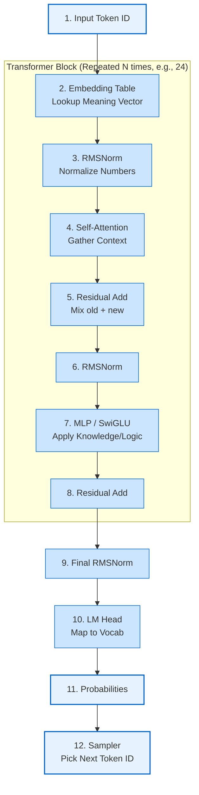

# Prerequisites: How an LLM Inference Engine Works

To understand `zLLM`, we first need to understand what a Large Language Model (LLM) actually is and how it generates text. This document breaks down the complex math into intuitive concepts, building from the ground up.

---

## 1. The Core Objective: Predicting the Next Word
At its absolute core, an LLM is a giant statistical calculator. It does not "understand" text; it calculates probabilities. 
If you give it the text: `"The capital of France is"`, the engine's only job is to calculate that the probability of the next word being `"Paris"` is 99%, and `"London"` is 0.1%.

Once it predicts `"Paris"`, it appends it to the input: `"The capital of France is Paris"`, and feeds the whole sentence back into the calculator to predict the next word (e.g., `"."`). This loop is called **Autoregression**.

---

## 2. Tokenization: Translating Text to Math
Computers cannot calculate words, only numbers. Before text enters the engine, it goes through a **Tokenizer**.

A Tokenizer relies on a vocabulary dictionary. It chops text into chunks called **Tokens** and assigns each an ID.
*   **Input**: `"Hello world!"`
*   **Tokens**: `["Hello", " world", "!"]`
*   **Token IDs**: `[9707, 1879, 0]`

In `zLLM`, a prompt like `"Hi"` is converted into an array of integers before any heavy lifting begins.

---

## 3. Tensors: The Shape of Data
Once we have numbers, we arrange them into **Tensors**. A tensor is simply a multi-dimensional array (like a nested list or a spreadsheet).

*   **0D Tensor (Scalar)**: A single number. (e.g., `0.5`)
*   **1D Tensor (Vector)**: A list of numbers. In LLMs, a single token is converted into a vector of numbers called an **Embedding**. This vector represents the "meaning" of the word in a mathematical space.
*   **2D Tensor (Matrix)**: A grid of numbers. The "knowledge" of the LLM (the weights) is stored as massive matrices.
*   **3D Tensor**: A cube of numbers. Used to represent multiple words, each having multiple dimensions, across multiple processing heads.

---

## 4. The Transformer Architecture: The Brain
`zLLM` implements a **Decoder-only Transformer** (the architecture behind GPT-4, Llama, and Qwen). 

When a token vector enters the engine, it passes through a stack of identical "Blocks" (layers). Think of each block as an assembly line station that refines the meaning of the token.

### The Three Pillars of a Block:
1.  **RMSNorm (Normalization)**: Keeps the numbers in the vectors from growing too large and exploding into infinity during calculations.
2.  **Self-Attention**: This is how the model understands context. If the sentence is *"The bank of the river"*, Attention allows the word *"bank"* to look at the word *"river"* and adjust its own vector to mean "land by water" instead of "financial institution".
3.  **MLP (Feed-Forward Network)**: This is where facts and logic are applied. After Attention figures out the context, the MLP transforms the vector using the model's deeply memorized knowledge.

---

## 5. KV Cache: The Speed Secret
Imagine reading a book. When you read page 10, you don't start reading from page 1 again to understand the context. You just remember what happened.

The **KV Cache (Key-Value Cache)** is the LLM's short-term memory.
In the Attention step, the model calculates a "Key" and a "Value" for every word. Instead of recalculating these for past words every time we predict a new word, we save them in GPU memory. When a new word is generated, the model only computes the Attention for the *new* word, comparing it against the saved cache of old words.

---

## 6. Quantization: Fitting the Elephant in a Fridge
A model's "Weights" (its knowledge matrices) are originally trained as high-precision 32-bit or 16-bit floating-point numbers (`f16`).
A 7 Billion parameter model in `f16` takes **14 GB** of RAM.

**Quantization** is a compression technique. We mathematically squash those 16-bit numbers into 8-bit, 5-bit, or even 4-bit integers. 
*   **Block Quantization**: We group 32 weights together. We find the maximum value in the group (the `Scale`, kept in `f16`), and compress the rest into tiny 4-bit indices relative to that scale.
*   **Result**: The 14 GB model now takes **4 GB** of RAM, running perfectly on consumer laptops with minimal loss in intelligence. (This is what the `GGUF` file format does).
